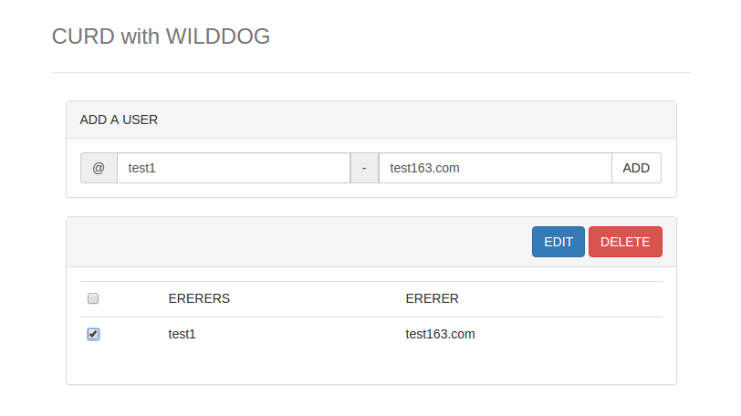

# demo-js-crud 增删改查demo

使用野狗进行数据管理，只需要基本的DOM操作和简单的API就可以进行数据增加，持久化查询，数据修改和删除。


## 在线示例
http://crud.wilddogapp.com/

[](http://crud.wilddogapp.com/)

## 本地运行
本地运行需要依赖node.js和gulp。
需要安装node.js和npm。

安装环境：

```
cd demo-js-crud
npm install -g gulp

npm install
bower install
```

启动http服务：

```
gulp serve
```

访问浏览器地址: http://127.0.0.1:9000/ 。

## 更多示例

这里分类汇总了 WildDog平台上的示例程序和开源应用，　链接地址：[https://github.com/WildDogTeam/wilddog-demos](https://github.com/WildDogTeam/wilddog-demos)

## 相关文档

* [Wilddog 概览](https://z.wilddog.com/overview/introduction)
* [JavaScript SDK快速入门](https://z.wilddog.com/web/quickstart)
* [JavaScript SDK 开发向导](https://z.wilddog.com/web/quickstart)
* [JavaScript SDK API](https://z.wilddog.com/web/api)
* [下载页面](https://www.wilddog.com/download/)
* [Wilddog FAQ](https://z.wilddog.com/faq/qa)

## License
MIT
http://wilddog.mit-license.org/


